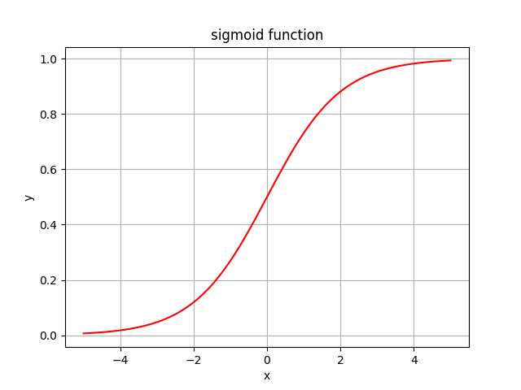
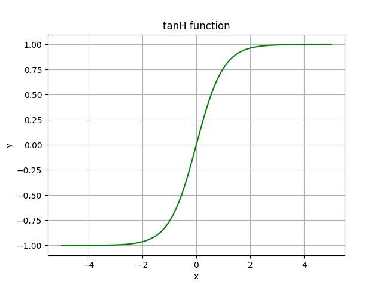
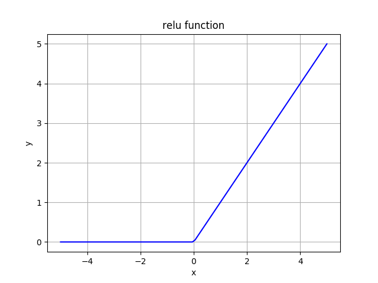

# Activation_Functions
The code is additional to the article on [my blog](https://siegel.work/blog/) and presents some popular **activation functions**. Sigmoid and tanH became less popular in last years. On the other hand, ReLu (*Rectified Linear Unit*) gained a lot popularity recently.

The link to the full article on [activation functions](https://siegel.work/blog/ActivationFunctions/).

## Dependencies ## 
To execute the code, you will need the following python libraries:

**NumPy** *(Numerical Python)* and
**Matplotlib** *(plotting library)*

You can read the official documentation on both:

[Numpy](https://docs.scipy.org/doc/numpy/index.html)

[Matplotlib](https://matplotlib.org/3.1.1/contents.html)

## How to install these dependencies ##

*For Linux users:*

pip install numpy
pip install matplotlib

*or if you experience problems with the environmental variables, try:*

pip install numpy --user
pip install matplotlib --user

*For Windows users:*

*open a cmd window and type in:*

python -m pip install numpy
python -m pip install matplotlib
